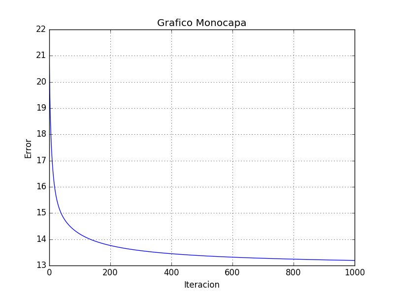
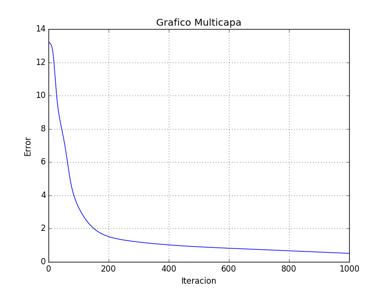

# FSI-Redes-Neuronales

* Josué Rodríguez González

Introducción:

En ese trabajo del curso consiste en crear una red neruonales artificiales
multicapa a partir de una red neuronales monocapa para clasificar las
características de la flor iris.


https://es.wikipedia.org/wiki/Iris_flor_conjunto_de_datos


Código:


Definir y generar valores aleatorios los pesos para 4 entradas -->  5 ocultas:

```{language:Python}
W1 = tf.Variable(np.float32(np.random.rand(4, 5))*0.1)
b1 = tf.Variable(np.float32(np.random.rand(5))*0.1)
```

Definir y generar valores aleatorios los pesos para 5 ocultas -->  3 salidas:

```{language:Python}
W2 = tf.Variable(np.float32(np.random.rand(5, 3))*0.1)
b2 = tf.Variable(np.float32(np.random.rand(3))*0.1)
```

Calcular los pesos de entrada --> oculta:

```{language:Python}
oculta = tf.sigmoid(tf.matmul(x, W1) + b1)
```

Calcular los pesos de oculta --> salida:

```{language:Python}
y = tf.nn.softmax(((tf.matmul(oculta, W2) + b2)))
```
Visualización de la tasa de error frente al número de iteraciones en este caso, Multicapa:

```{language:Python}

plt.plot(iterations, error_graphic)
plt.xlabel('Iteracion')
plt.ylabel('Error')
plt.title('Grafico Multicapa')
plt.grid(True)
plt.savefig('error-multicapa.png')
plt.show()
```

*Resultados:
Podemos observar en las siguientes imágenes cómo la tasa de error disminuye al incrementar las iteraciones.




*Observaciones:

El gráfico generado por **iris_two_layers.py** varía para cada ejecución, ya que depende de la distribución de los datos en el archivo *iris.data* al que le le hacemos un: numpy.random.shuffle(data) al principio.


